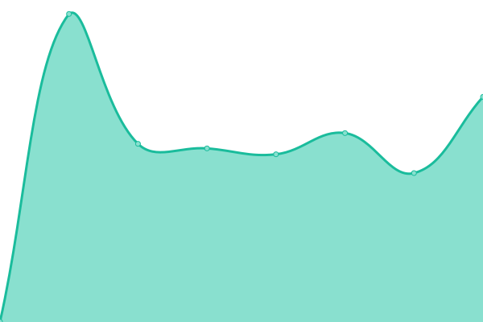
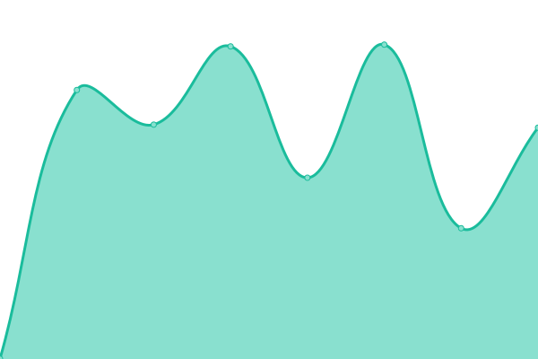
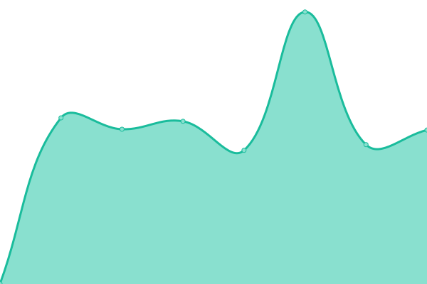
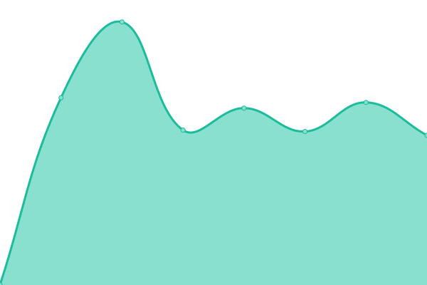

# [📈 Live Status](https://cod3cow.github.io/uptime-akjs): <!--live status--> **🟩 All systems operational**

This repository contains the open-source uptime monitor and status page, powered by [Upptime](https://github.com/upptime/upptime).

With [Upptime](https://upptime.js.org), you can get your own unlimited and free uptime monitor and status page, powered entirely by a GitHub repository. We use [Issues](https://github.com/cod3cow/uptime-akjs/issues) as incident reports, [Actions](https://github.com/cod3cow/uptime-akjs/actions) as uptime monitors, and [Pages](https://cod3cow.github.io/uptime-akjs) for the status page.

<!--start: status pages-->
<!-- This summary is generated by Upptime (https://github.com/upptime/upptime) -->
<!-- Do not edit this manually, your changes will be overwritten -->
<!-- prettier-ignore -->
| URL | Status | History | Response Time | Uptime |
| --- | ------ | ------- | ------------- | ------ |
|  [kashilo.com](https://kashilo.com) | 🟩 Up | [kashilo-com.yml](https://github.com/cod3cow/uptime-akjs/commits/HEAD/history/kashilo-com.yml) | 

 762ms
     
 | 

<a href="https://cod3cow.github.io/uptime-akjs/history/kashilo-com">100.00%</a>
    

|  [xmr.rocks](https://xmr.rocks) | 🟩 Up | [xmr-rocks.yml](https://github.com/cod3cow/uptime-akjs/commits/HEAD/history/xmr-rocks.yml) | 

 714ms
     
 | 

<a href="https://cod3cow.github.io/uptime-akjs/history/xmr-rocks">100.00%</a>
    

|  [pmnr.xmr.rocks](https://pmnr.xmr.rocks) | 🟩 Up | [pmnr-xmr-rocks.yml](https://github.com/cod3cow/uptime-akjs/commits/HEAD/history/pmnr-xmr-rocks.yml) | 

 767ms
     
 | 

<a href="https://cod3cow.github.io/uptime-akjs/history/pmnr-xmr-rocks">100.00%</a>
    

|  [lookrativ.de](https://lookrativ.de) | 🟩 Up | [lookrativ-de.yml](https://github.com/cod3cow/uptime-akjs/commits/HEAD/history/lookrativ-de.yml) | 

 853ms
     
 | 

<a href="https://cod3cow.github.io/uptime-akjs/history/lookrativ-de">100.00%</a>
    

|  [kunst-kasten.de](https://kunst-kasten.de) | 🟩 Up | [kunst-kasten-de.yml](https://github.com/cod3cow/uptime-akjs/commits/HEAD/history/kunst-kasten-de.yml) | 

 899ms
     
 | 

<a href="https://cod3cow.github.io/uptime-akjs/history/kunst-kasten-de">100.00%</a>
    

<!--end: status pages-->

[**Visit our status website →**](https://cod3cow.github.io/uptime-akjs)

## 📄 License

- Powered by: [Upptime](https://github.com/upptime/upptime)
- Code: [MIT](./LICENSE)
- Data in the `./history` directory: [Open Database License](https://opendatacommons.org/licenses/odbl/1-0/)
